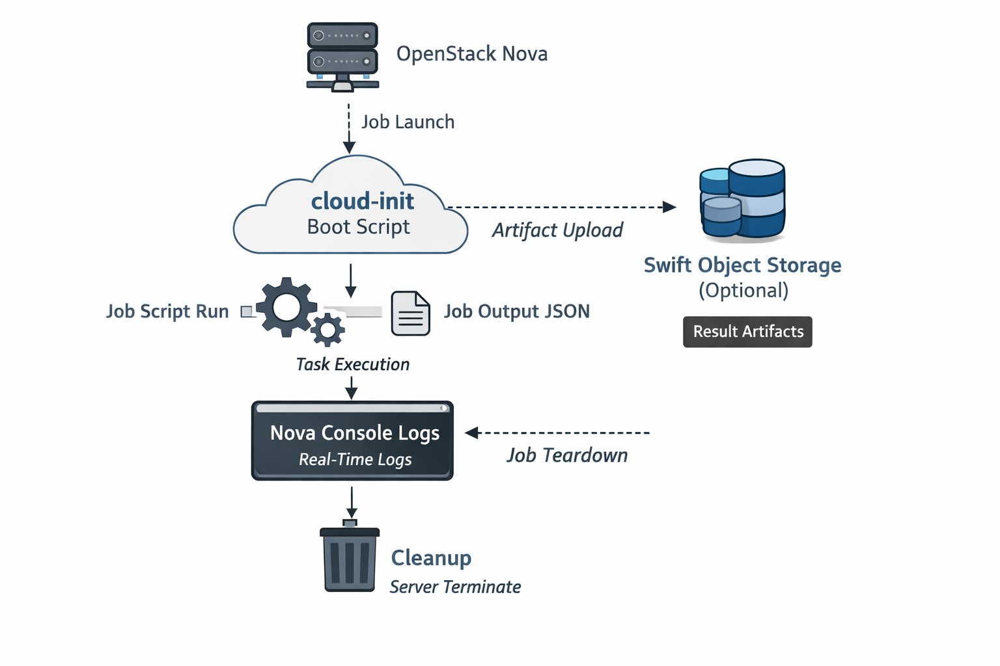

# nova-mlops-lab

OpenStack-first MLOps job runner with a **LightSpeed-style interface**:

```
run → logs → cleanup
```

Designed for **DevStack labs** where OpenStack runs inside a **KVM VM**, and where:

- Floating IPs can be fragile until `br-ex` is wired correctly
- Direct SSH access to instances may be unreliable or intentionally unavailable
- Networking state can change after restacks / reboots

This project intentionally works **without requiring SSH into instances**. It relies on **cloud-init** and **Nova console logs** to run and observe workloads.

---

## What you learn by using this repo

This repo is a practical “operator-style” OpenStack lab. It teaches how to:

- Launch ephemeral workloads as Nova servers
- Use cloud-init as the execution mechanism (boot-time payload)
- Debug boot and workload failures via **console logs**, not SSH
- Understand the Neutron data path (router namespaces, `qg-*`, `qr-*`, `br-ex`)
- Recover external connectivity when `br-ex` wiring or host routing is wrong
- Collect structured job outputs (JSON) without logging into instances

---

## Current MVP

### OpenStack probes

```bash
nova-mlops openstack ping
nova-mlops openstack images
nova-mlops openstack flavors
nova-mlops openstack networks
```

### Job execution

```bash
nova-mlops openstack run <job>
nova-mlops openstack logs <job>
nova-mlops openstack cleanup <job>
```

### Local job state

```text
.nova-mlops/state/
  <job-name>.json
```

No daemon. No database. Fully CLI-driven.

---

## How it works

The CLI is intentionally **stateless between invocations**:

- `run` creates a Nova server and stores the `server_id` locally
- `logs` fetches Nova console output (your primary observability surface)
- `cleanup` deletes the server and updates local state

This mirrors real OpenStack debugging: early-boot visibility is through console logs and cloud-init telemetry.

---

## Prerequisites

### Recommended environment

Run OpenStack (DevStack) **inside a KVM VM**, not directly on your daily desktop. This keeps your host clean and makes rollback easy (snapshots).

You need:

- A working DevStack installation
- `openstack` CLI working (`openstack token issue`)
- Python **≥ 3.10**

### OpenStack authentication

`openstacksdk` uses the same auth sources as the OpenStack CLI:

- `source openrc ...`
- `~/.config/openstack/clouds.yaml`

---

## Quickstart (DevStack / Ubuntu 24.04)

### 1) Clone and create a virtual environment

Ubuntu 24.04 enforces PEP 668. Use a virtual environment:

```bash
git clone https://github.com/miharcan/nova-mlops-lab.git
cd nova-mlops-lab

python3 -m venv .venv
source .venv/bin/activate
python -m pip install -U pip

pip install -e ".[openstack]"
```

If `venv` is missing:

```bash
sudo apt update
sudo apt install -y python3-venv python3-full
```

### 2) Validate OpenStack access

```bash
source /opt/stack/devstack/openrc admin admin
openstack token issue
openstack server list
```

### 3) Run a job

> **Important:** `ubuntu-24.04` requires at least `m1.small`.

```bash
nova-mlops openstack run sentiment-demo   --image ubuntu-24.04   --flavor m1.small   --network private
```

### 4) Read logs

```bash
nova-mlops openstack logs sentiment-demo
```

### 5) Cleanup

```bash
nova-mlops openstack cleanup sentiment-demo
```

---

## Getting job outputs (JSON) without SSH

The sentiment demo emits **structured JSON** that you can collect in two ways:

### Option A: Parse JSON from Nova console logs (default)

```bash
nova-mlops openstack logs sentiment-demo
```

You should see output similar to:

```json
{
  "job": "sentiment-demo",
  "results": [
    {
      "text": "OpenStack executed this workload successfully.",
      "neg": 0.0,
      "neu": 0.556,
      "pos": 0.444,
      "compound": 0.4939
    }
  ]
}
```

This is the most reliable lab workflow: it works even when networking is imperfect.

### Option B: Save and retrieve JSON via Swift (Object Storage)

If your job uploads `result.json` to a Swift container (e.g. `mlops-artifacts`), retrieve it like this:

```bash
# list objects
openstack object list mlops-artifacts

# download an object
openstack object save mlops-artifacts sentiment-demo.json --file ./sentiment-demo.json
```

This is useful if you want to delete the instance but retain artifacts.

---

## Architecture diagram



## Cinder volumes (optional)

Use **Cinder** when you want:

- Data to survive instance deletion
- Larger storage than the image root disk
- Re-attachable job outputs between runs

The CLI supports volumes via an optional flag such as:

```bash
--cinder-volume-size-gb <size>
```

Start without Cinder for simplicity; add it once you want persistent artifacts.

---

## Troubleshooting

All troubleshooting pathways are documented in:

👉 **[docs/troubleshooting.md](docs/troubleshooting.md)**

This includes:
- KVM / libvirt install and validation
- Serial-console “hangs” that are actually paused VMs
- External networking (`br-ex`) and routing fixes
- Netplan persistence for `br-ex`
- cloud-init failures caused by `/bin/sh` vs bash
- Egress / NAT issues after restacks

---

## Development workflow

```bash
pip install -e ".[openstack,dev]"
ruff check .
pytest -q
```

---

## Roadmap

- `nova-mlops openstack status <job>`
- Log filtering and structured markers (e.g. `[NOVA-MLOPS]`)
- Artifact collection helpers (Swift-first)
- Optional SSH execution path (add-on, not required)
- CI (GitHub Actions)